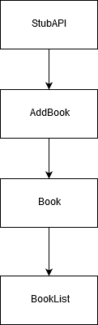

# ReactSPA
Single page application developed in React for a Web App Development assignment.

# BSc (Hons.) Level 8 - Assignment 1 - Single Page app.

Name: Adam Cotter

## Overview.

A library app for storing information about books.

. . . . . List of user features  . . . .

- Books can be added to the list
- Book title, page number and genre can be stored.

## Setup.

You will need to have Node Package Manager installed to run the app.

After download the repo to your machine, enter the folder in a command line interface  and run the command 
>npm install

after the install has finished, run
>npm start

and the application will open in your browser shortly. If it doesn't open automatically, go to "localhost:3000" to view the app.

## Data Model Design.

## UI Design.

The main view of the page.

The interface for adding a book.

The display of a book in the library.
